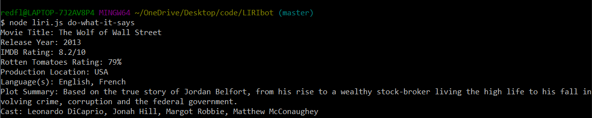

# LIRIbot

This app was designed to accomplish 4 tasks when given a user input.

1. When given the input of concert-this followed by a artist currently on tour it will display the venue name location and date of their next 20 upcoming shows.
1. When given the input of spotify-this-song followed by a song title, the app will display the artist(s), the song's name, a preview link of the song from Spotify, and the album that the song is from.
If no song name is given it defaults to "Dreams and Nightmares" by Meek Mill.
1. When given the input movie-this followed by a movie title the app will display 
    * Title of the movie.
    * Year the movie came out.
    * IMDB Rating of the movie.
    * Rotten Tomatoes Rating of the movie.
    * Country where the movie was produced.
    * Language of the movie.
    * Plot of the movie.
    * Actors in the movie.
if no movie title is given it will default to "Mr. Nobody"
1. When given the input do-what-it-says the app reads the text on a text file called random.txt. Depending on what the text says it will run that command followed by song/movie/artist. 

## Screenshots

If no command is entered you will get this screen

The list of commands is 
* spotify-this-song
* concert-this
* movie-this
* do-what-it-says

Default spotify-this-song looks like:

You can also enter the title of a song you would like to search as well:

concert-this can be used to see a list of upcoming concerts for an artist entered:

The movie-this command has a default of Mr. Nobody:

There is also the ability to add your own title to search:

The last command is do-what-it-says and this reads from the .txt file and completes the command from there:

In this case it is reading to do another movie command and the title "Wolf of Wall Street". It can complete any of the other 3 commands as well if that is what is written in the text file.

**Link to watch it in action** **https://drive.google.com/file/d/18QKa1x_f08BmacwylowBQMDMmpCWKQWH/view**

## Installs
Requires an install of node

## Deployment
This app does not have a front end and is run in the user's console. There are no steps for deployment.

## Built with 
* Node.js